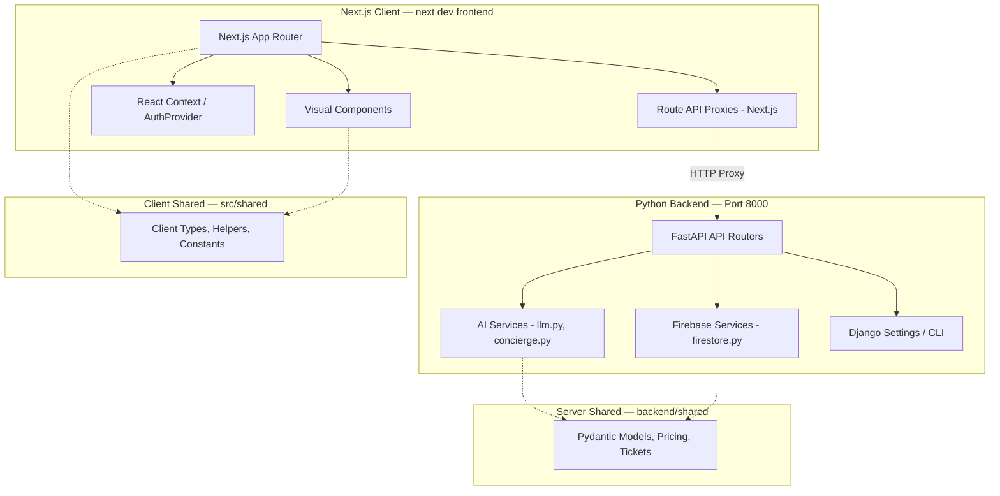
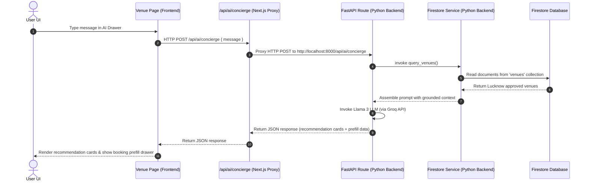

# System Architecture Guide

This document describes the design patterns, architecture boundaries, and cross-layer call flows of **PlaySphere AI**.

---

## 🏗️ Layered Architecture Overview

The system is separated into three distinct layers to ensure separation of concerns, testability, and clarity for developers.

### 1. Frontend Layer
* **App Router (`frontend/src/app`)**: Decides the routing, layout, and pages. Pages act as entrypoints that mount client-side templates and connect state events to actions.
* **Visual Components (`frontend/src/components`)**: Reusable widgets (cards, maps, dashboards) styled using Tailwind CSS and CSS variables.
* **Contexts (`frontend/src/contexts`)**: Handles global React state (Theme state and Auth session sync).
* **API Proxies (`frontend/src/app/api`)**: Minimal Next.js route handlers that intercept HTTP requests to `/api/ai/*` or `/api/admin/*` and forward them directly to the Python FastAPI backend.

### 2. Backend Layer
* **FastAPI Routing (`backend/api`)**: Defines async routes that handle AI interactions and admin discovery.
* **AI Services (`backend/ai`)**: Grounded LLM reasoning, scoring/ranking, OSM crawler, and prompt generation.
* **Firebase Services (`backend/firebase_service`)**: Directly manages Firebase Admin SDK initializations and Firestore reads/writes.
* **Django Core (`backend/core`)**: Management commands (such as the verification test suite) and setting files.

### 3. Shared Domains
* **Client Shared (`frontend/src/shared`)**: Shared frontend utilities, UI constants, and TypeScript types.
* **Server Shared (`backend/shared`)**: Pydantic validation schemas, booking ticket generation, and slot pricing rules.

---

## 🔄 Core Call Flow Sequence (Example: AI Concierge query)

This diagram shows how a user query on the frontend traverses through the proxy to the Python backend and back:

---

## 🎨 Theme & Styling System
We use a **Neo-Brutalist design language** featuring:
1. **Bold Borders**: Consistent 3px solid black (`border-3 border-black`) borders.
2. **High-Contrast Shadows**: Hard, non-blurry shadows using `box-shadow` (e.g. `box-shadow: 4px 4px 0px #000000;`).
3. **Stark Colors**: Neon yellows (`#facc15`), cyans (`#22d3ee`), and pinks (`#f472b6`) offset by deep space darks (`#080a10`).
4. **Interactive Offsets**: Interactive elements translate slightly on hover and press (e.g. `translate(-2px, -2px)`) while altering shadow weights to give a tactile feel.
